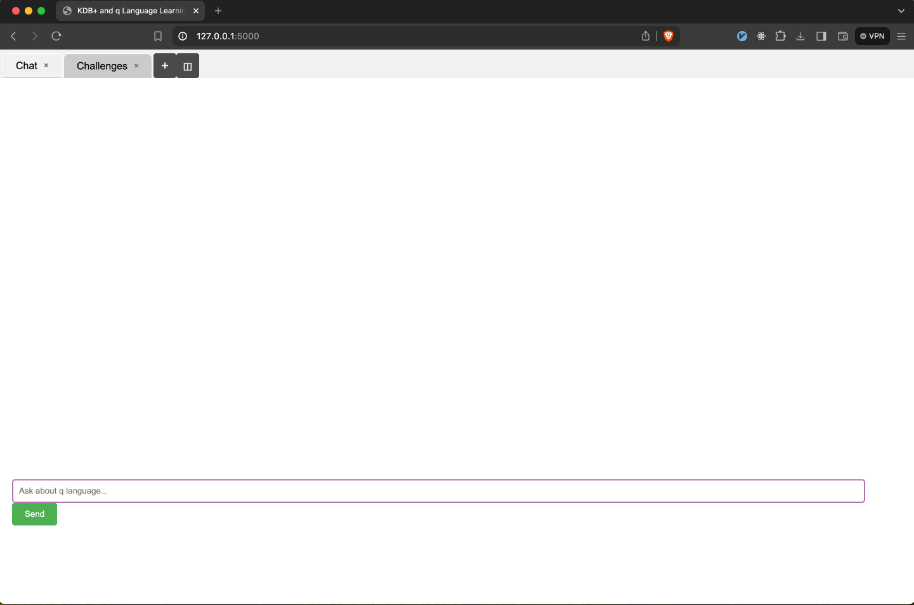

# q_advisor_ai



## Overview

q_advisor is a question-answering system based on the content of PDF documents to help study kdb+ and q language. It uses Claude API to generate answers to user queries using relevant information extracted from PDFs.

## Architecture


## Requirement

- macOS
- python
- Claude API subscription

## Usage

```
git clone ...
cd q_advisor_ai
python3 -m venv venv
source venv/bin/activate
pip install Flask anthropic faiss-cpu joblib numpy scikit-learn markdown2
export ANTHROPIC_API_KEY='put_your_key_here'
python app.py
```

## Other Service

GPTs version is available here.

[Q advisor for kdb+](https://chatgpt.com/g/g-xsRgQV9lF-q-advisor-for-kdb)

## Licence

[MIT](.LICENSE)
